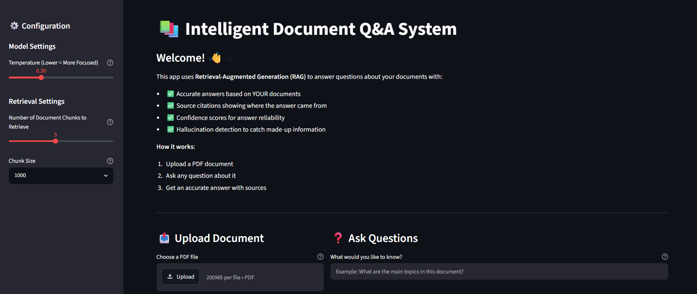

# 📚 Intelligent Document Q&A System using RAG

An AI-powered Document Question Answering system built using **Retrieval-Augmented Generation (RAG)** that allows users to upload PDF documents and ask natural language questions. The application retrieves the most relevant sections from the document before generating accurate answers using a Large Language Model (LLM).

The project also incorporates **Responsible AI** features such as confidence scoring, hallucination detection, and source transparency to improve trust and explainability.

---

# 🚀 Features

- 📄 Upload any PDF document
- 🤖 Ask natural language questions
- 🧠 Retrieval-Augmented Generation (RAG)
- 🔍 Semantic search using FAISS Vector Database
- 📚 HuggingFace Embeddings
- ⚡ Groq LLM Integration (Llama-3.3-70B-Versatile)
- 🎯 Custom Prompt Engineering
- 📊 Confidence Score for every answer
- 🛡️ Responsible AI safety checks
- ⚠️ Hallucination Detection
- 📖 Source Citation & Expandable Source Viewer
- 🎛️ Adjustable Chunk Size (500 / 1000 / 1500)
- 🌐 Streamlit Web Interface

---

# 🏗️ System Architecture

```
                    PDF Document
                          │
                          ▼
                  PyPDF Document Loader
                          │
                          ▼
              Recursive Character Splitter
                          │
                          ▼
                 HuggingFace Embeddings
                          │
                          ▼
                  FAISS Vector Database
                          │
                          ▼
                     Retriever
                          │
                          ▼
                 Groq LLM (Llama 3.3 70B)
                          │
                          ▼
              Responsible AI Module
                          │
                          ▼
                 Streamlit Web Interface
```

---

# 🛠️ Tech Stack

| Technology | Purpose |
|------------|---------|
| Python | Programming Language |
| Streamlit | Web Application |
| LangChain | RAG Pipeline |
| Groq API | LLM Inference API |
| HuggingFace | Sentence Embeddings |
| FAISS | Vector Database |
| PyPDF | PDF Loading |
| Responsible AI | Trust & Safety Checks |

---

# 📂 Project Structure

```
intelligent-document-qa-rag/

│── app.py
│── streamlit_app.py
│── responsible_ai.py
│── requirements.txt
│── README.md
│── API_SETUP.md
│── .gitignore
│── sample_document.pdf
│── .env
```

---

# ⚙️ Installation

## 1. Clone the repository

```bash
git clone https://github.com/Karan7505/intelligent-document-qa-rag.git

cd intelligent-document-qa-rag
```

---

## 2. Create Virtual Environment

### Windows

```bash
python -m venv venv

venv\Scripts\activate
```

### macOS/Linux

```bash
python3 -m venv venv

source venv/bin/activate
```

---

## 3. Install Dependencies

```bash
pip install -r requirements.txt
```

---

# 🔑 Environment Variables

Create a `.env` file in the project root.

```text
GROQ_API_KEY=your_groq_api_key
GOOGLE_API_KEY=your_google_api_key
```
Get your API keys from **Groq** and **Google AI Studio**, then replace the placeholder values in your `.env` file.

---

# ▶️ Run the Application

Launch the Streamlit application:

```bash
streamlit run streamlit_app.py
```
The application will automatically open in your default web browser. If it doesn't, open the local URL shown in the terminal (usually http://localhost:8501).

For testing the terminal version:

```bash
python app.py
```

---

# 💡 Responsible AI Features

The application includes a dedicated Responsible AI module that performs:

- Confidence Scoring
- Query Validation
- Source Transparency
- Hallucination Detection
- Safety Recommendations

Example Output:

```
Confidence Score : 95%

Sources Found : 5

Reliability Check : Safe

Recommendation :

✅ Answer appears reliable
```

---

# 📚 How It Works

1. Upload a PDF.
2. The document is split into chunks.
3. Chunks are converted into embeddings.
4. Embeddings are stored in a FAISS Vector Database.
5. The Retriever finds the most relevant chunks.
6. Groq LLM generates the answer using the retrieved document context.
7. Responsible AI evaluates the response.
8. The answer, confidence score and sources are displayed.

---

# 🎯 Current Features

- ✅ PDF Upload
- ✅ Semantic Search
- ✅ RAG Pipeline
- ✅ Groq Integration
- ✅ Streamlit Interface
- ✅ Responsible AI
- ✅ Confidence Score
- ✅ Hallucination Detection
- ✅ Source Viewer
- ✅ Dynamic Chunk Size

---

# 🗺️ Project Roadmap

- [ ] Download PDF Report
- [ ] Adjustable Chunk Overlap
- [ ] Adjustable Top-K Retrieval
- [ ] ChatGPT-style Interface
- [ ] Conversation Memory
- [ ] Multi-PDF Support
- [ ] OCR Support for Scanned PDFs
- [ ] Multi-Model Support
- [ ] RAG Evaluation Dashboard
- [ ] Authentication & User Accounts

---

# 📈 Learning Outcomes

This project demonstrates practical implementation of:

- Retrieval-Augmented Generation (RAG)
- Vector Databases
- Semantic Search
- Prompt Engineering
- Large Language Models
- Responsible AI
- Streamlit Development
- LangChain Framework
- Production Deployment

---

# 📸 Screenshots

### Home Screen

**

---

### Question Answering

*(Add screenshot here)*

---

### Responsible AI Output

*(Add screenshot here)*

---

# 👨‍💻 Author

**Karan Kaushal**

QA Engineer | AI Enthusiast | RAG & Responsible AI Projects

**LinkedIn:** https://www.linkedin.com/in/karan1112

**GitHub:** https://github.com/Karan7505

---

# ⭐ If you found this project useful

Consider giving the repository a ⭐ on GitHub.

Feedback, suggestions, and contributions are always welcome. If you have ideas for improving this project, feel free to open an issue or submit a pull request.